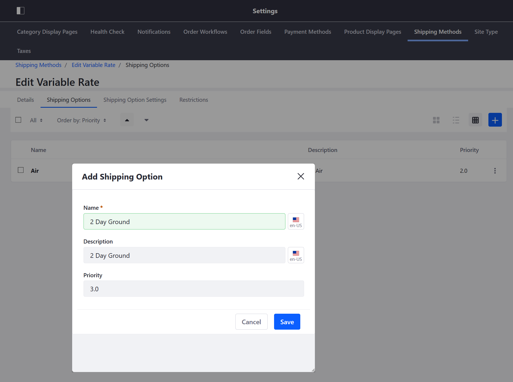

# Using the Variable Rate Shipping Method

Variable rate shipping calculates shipping costs using three factors: the order’s weight, its subtotal (cost before shipping and taxes), and any fixed price you impose. You choose the priority of each factor.

You can create multiple different shipping options with variable rates. For example, you might create a 'Standard Ground' option with a relatively low cost per unit of weight, as well as a “Two-Day Air” option that calculates costs in the same way but results in a higher price.

## Creating a Variable Rate Shipping Option

Variable-rate shipping costs are determined by the following formula: `shipping costs = [fixed price] + ([order total weight] x [rate unit weight price]) * ([order subtotal] x [rate percentage])`.

To create a new Variable Rate shipping option:

1. Navigate to the _Control Panel_ → _(your site)_ → _Commerce_ → _Settings_.
1. Click the _Shipping Methods_ tab.
1. Click _Variable Rate_.
1. Click the _Shipping Options_ tab.
1. Click the (+) button to add a new Shipping option:
1. Enter the following:
    * **Name**: 2 Day Ground
    * **Description**: 2 Day Ground
    * **Priority**: 3.0

    

1. Click _Save_.

The new shipping option has been created. To finish configuring this shipping option, apply the variable shipping costs.

1. Click the _Shipping Option Settings_ tab.
1. Click the (+) button to add the variable rate costs formula.
1. Fill in the following fields:

    **Shipping Option:** Select the shipping option for this setting.

    **Warehouse:** Select a warehouse if this method should apply only to shipments from one location. Leave blank to use this method for all warehouses.

    **Country, Region, Zip:** Make an entry if this shipping method should be restricted to destinations within the area you define.

    **Weight From, Weight To:** Enter a weight range for orders that can use this option.

    **Fixed Price:** An entry in this field sets an effective minimum price and contributes the fixed component of the shipping cost formula. It can be left blank.

    **Rate Unit Weight Price:** An entry in this field imposes a cost per unit of weight. It can be left blank.

    **Rate Percentage:** An entry in this field imposes a shipping cost based on a percentage of the order subtotal. It can be left blank.

   

1. Click _Save_.

To create more than one option, return to the _Shipping Options_ tab and repeat steps 2 through 4. Because the country field is blank, there are no restrictions on where the shipments can go.

To activate this shipment method:

1. Click the _Details_ tab.
1. Toggle the _Active_ button to _YES_.
1. Click _Save_.

The _Details_ tab also contains fields for changing the name and description of the flat rate shipping method type. They may be useful for reference, but the text is not automatically displayed to buyers. You can also set a priority, which orders variable rate shipping methods relative to other types.

## Additional Information

* [Using a Flat Rate Shipping Method](../using-the-flat-rate-shipping-method/README.md)
* [Using Fedex as a Carrier Method](../using-fedex-as-a-carrier-method/README.md)
* [Applying Shipping Method Restrictions](../applying-shipping-method-restrictions/README.md)
* [Measurement Units](../measurement-units/README.md)
* [Shipping Method Reference](../shipping-reference/README.md)
* Creating a New Shipment (TODO)
